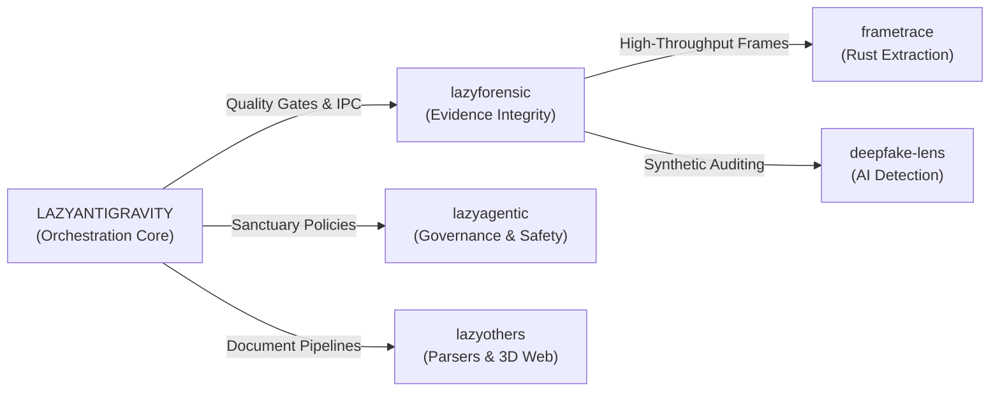

# Hi, I'm daeryundf2-prog 👋

> **Systems Architect & Open-Source AI Tooling Creator**  
> Building deterministic multi-agent orchestration frameworks, fail-closed digital forensic engines, and high-performance polyglot infrastructure.

---

## 🌟 Featured: The Lazy Series (Open-Source Ecosystem)

An integrated family of developer-first open-source tools designed for deterministic code generation, multi-agent orchestration, and tamper-evident evidence analysis.

| Repository | Primary Tech | Role & Capabilities |
| :--- | :--- | :--- |
| **[`LAZYANTIGRAVITY`](https://github.com/daeryundf2-prog/LAZYANTIGRAVITY)** | TypeScript / Node | **Core Orchestration Layer**: 36+ specialist engineering skills, zero-latency IPC state blackboard, and automated AST/test verification gates. |
| **[`lazyforensic`](https://github.com/daeryundf2-prog/lazyforensic)** | Python | **Digital Forensics Suite**: Fail-closed evidence integrity engine, timeline reconstruction, and SHA-256 chain-of-custody tracking. |
| **[`lazyagentic`](https://github.com/daeryundf2-prog/lazyagentic)** | JavaScript / Node | **Prompt Governance**: Agentic sanctuary architecture enforcing strict fail-closed anti-hallucination mandates and deterministic reasoning. |
| **[`lazyothers`](https://github.com/daeryundf2-prog/lazyothers)** | HTML / JS / Python | **Document & Domain Automation**: High-performance HWP/HWPX/PDF parsers, court evidence binders, PII maskers, and 3D WebGL interfaces. |
| **[`frametrace`](https://github.com/daeryundf2-prog/frametrace)** | Rust | **Multimedia Forensics**: High-throughput video frame extraction and tamper-evident multimedia artifact processing pipeline. |
| **[`deepfake-lens`](https://github.com/daeryundf2-prog/deepfake-lens)** | Python | **AI Authenticity Radar**: Multimodal deepfake detection and synthetic media provenance verification engine. |

---

## 🔬 Core Engineering Principles

* **Fail-Closed Verification**: Never accept hallucinated greens or unverified assumptions. Every agent trajectory and forensic finding is bound to verifiable primary evidence (checksums, execution logs, AST invariants).
* **Zero-Latency In-Memory IPC**: Distributed state sharing between concurrent worker sub-agents via ultra-fast local daemon bridges.
* **Polyglot Systems Discipline**: Strict typing, modern runtime constraints, and defensive boundary validation across TypeScript, Python, Rust, and Go.

---

## 🏛️ Applied Domain Engineering: OmniLegal Kits

Field-tested legal technology frameworks and automated forensic practice packages developed for practitioners:

* 🛡️ **Digital Forensic Analysis Master Kit**: ECFS-compliant evidence integrity auditing, SHA-256 chain-of-custody verification, and expert report templates.
* 🔍 **Deepfake Incident & Emergency Defense Suite**: Generative AI synthetic artifact checklist, emergency injunctions, and preservation motions.
* ⚖️ **Contract Risk Defense & Clause Hardening**: 30+ toxic clause automated detection filters and intellectual property shielding frameworks.
* 📑 **Defamation & Cyber Infringement Toolkit**: Web evidence capture protocols, identity specificity mapping, and formal complaint drafts.

👉 **[Explore OmniLegal Storefront](https://daeryundf2-prog.github.io/omni-store/)**

---

## 📬 Connect & Community

* **GitHub**: [@daeryundf2-prog](https://github.com/daeryundf2-prog)
* **Storefront Support**: [OmniLegal Support](https://daeryundf2-prog.github.io/omni-store/)
* **Open Source Inquiries**: Welcoming issues, PRs, and collaborative benchmarks across the Lazy ecosystem.
